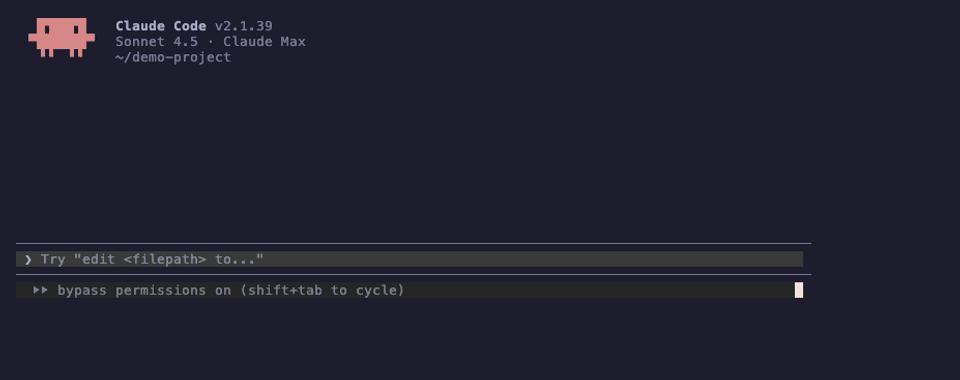

<div align="center">
  <h1>Flyto Indexer</h1>
  <p>
    <strong>Know what breaks before you change it.</strong>
  </p>
  <p>
    <a href="https://github.com/flytohub/flyto-indexer/actions"></a>
    <a href="https://pypi.org/project/flyto-indexer/"></a>
    <a href="https://github.com/flytohub/flyto-indexer/blob/main/LICENSE"></a>
    <a href="https://www.python.org/downloads/"></a>
  </p>
  <p>
    MCP server that gives AI assistants impact analysis, cross-project reference tracking, and code health scoring.<br/>
    Zero dependencies. Pure Python. 100% local.
  </p>
</div>

---

## Without Flyto Indexer

```
You:    "Rename validateOrder to validate_order"

AI:     *renames the function*
        *greps for "validateOrder"*
        *finds 3 matches in the same project*
        *misses 4 callers in the frontend repo*
        *misses the API endpoint that routes to it*
        *pushes broken code*
```

## With Flyto Indexer

```
You:    "Rename validateOrder to validate_order"

AI:     → impact_analysis("validateOrder")

        ⚠️ 7 call sites across 3 projects:
          backend/checkout.py:42     — calls validateOrder()
          backend/api/orders.py:18   — imports validateOrder
          frontend/Cart.vue:55       — calls via useCheckout()
          frontend/QuickBuy.vue:23   — calls via useCheckout()
          mobile/OrderScreen.tsx:67  — API call to /api/validate
          tests/test_orders.py:12    — unit test
          tests/test_api.py:88       — integration test
          Risk: HIGH — 3 projects affected

        → edit_impact_preview("validateOrder", change_type="rename")
        *renames all 7 call sites, updates tests, pushes clean code*
```

**That's the difference.** grep finds text. This finds dependencies.

<div align="center">
  
</div>

## Install

```bash
pip install flyto-indexer
flyto-index scan .
```

Add to Claude Code (`~/.claude/settings.json`):

```json
{
  "mcpServers": {
    "flyto-indexer": {
      "command": "python3",
      "args": ["-m", "flyto_indexer.mcp_server"]
    }
  }
}
```

Done. Works with any MCP client — Claude Code, Cursor, Windsurf, etc.

<details>
<summary>Run from source</summary>

```bash
git clone https://github.com/flytohub/flyto-indexer.git
cd flyto-indexer && pip install -e .
flyto-index scan /path/to/your/project
python -m src.mcp_server
```
</details>

## What It Does

### Impact Analysis — the core feature

Every tool an AI already has (grep, file read, glob) finds **text**. None of them answer **"what depends on this?"**

`impact_analysis` builds a reverse dependency graph and tells you exactly what breaks:

```
→ impact_analysis("useAuth")

  12 references across 4 projects:
    flyto-cloud:  LoginPage.vue, RegisterPage.vue, AuthGuard.ts, api.ts
    flyto-pro:    vscode_agent/tools.py, middleware/auth.py
    flyto-vscode: ChatHandler.ts, AuthProvider.ts
    flyto-core:   modules/auth/login.py
  Risk: HIGH — shared across 4 projects

→ edit_impact_preview("useAuth", change_type="signature_change")
  Shows exact code lines at each call site that need updating.
```

### Cross-Language API Tracking

Python backend endpoints automatically linked to TypeScript/Vue frontend callers:

```
→ list_apis()

  POST /api/checkout
    Defined in: backend/routes/order.py (create_order)
    Called by:   frontend/Cart.vue, frontend/api/orders.ts
    Call count: 4
```

Detects FastAPI, Flask, Starlette decorators + `fetch()`, `axios`, `$http` calls.

### Code Health & Security

```
→ code_health_score()            → security_scan()

  Score: 74/100 (C)               2 critical: hardcoded API keys
  Complexity:    22/25             1 high: SQL string concatenation
  Dead code:     18/25             0 medium
  Documentation: 16/25
  Modularity:    18/25

→ suggest_refactoring()

  [high]   process_data() — 87 lines, depth=6 → extract sub-functions
  [medium] dead_fn() — unreferenced, 45 lines → safe to remove
  [low]    utils.py — 800 lines → split into focused modules
```

## Tools

30 MCP tools. Organized by what they do:

**Impact & Dependencies** — the reason to install this

| Tool | What it answers |
|------|----------------|
| `impact_analysis` | "What breaks if I change this?" |
| `impact_from_diff` | "What's the blast radius of my uncommitted changes?" |
| `find_references` | "Who calls this function?" (with file + line) |
| `cross_project_impact` | "Which other repos use this?" |
| `edit_impact_preview` | "Show me the exact lines affected by this rename" |
| `dependency_graph` | "What does this file import / what imports it?" |

**Code Quality** — catch problems before review

| Tool | What it answers |
|------|----------------|
| `code_health_score` | "How healthy is this project?" (0-100, A-F) |
| `security_scan` | "Any hardcoded secrets or injection risks?" |
| `find_dead_code` | "What's safe to delete?" |
| `find_complex_functions` | "Which functions need refactoring?" |
| `suggest_refactoring` | "What should I fix first?" |
| `find_duplicates` | "Where's the copy-pasted code?" |
| `find_stale_files` | "What hasn't been touched in months?" |
| `find_todos` | "What's the tech debt backlog?" |

<details>
<summary>All 30 tools (including search, metadata, session)</summary>

**Search & Discovery**

| Tool | Description |
|------|-------------|
| `search_code` | BM25-ranked symbol search |
| `get_symbol_content` | Full source of a function/class |
| `get_file_symbols` | All symbols in a file |
| `get_file_info` | File purpose, category, keywords |
| `get_file_context` | One-call: symbols + deps + test file |
| `fulltext_search` | Search comments, strings, TODOs |

**Project Overview**

| Tool | Description |
|------|-------------|
| `list_projects` | Indexed projects with stats |
| `list_categories` | Code categories (auth, payment...) |
| `list_apis` | API endpoints + cross-language callers |
| `check_index_status` | Is the index fresh or stale? |

**File Metadata**

| Tool | Description |
|------|-------------|
| `find_test_file` | Source → test file mapping |
| `get_description` | Semantic one-liner for a file |
| `update_description` | Write/update file description |

**Session & Indexing**

| Tool | Description |
|------|-------------|
| `session_track` | Track events for search boosting |
| `session_get` | Inspect session state |
| `check_and_reindex` | Detect changes + live reindex |
| `impact_from_diff` | Git diff → symbol impact analysis |

</details>

## Languages

| Language | Parser | Extracts |
|----------|--------|----------|
| Python | AST | Functions, classes, methods, decorators, API routes |
| TypeScript/JS | Custom | Functions, classes, interfaces, types, API calls |
| Vue | SFC | Components, composables, emits, props |
| Go | Custom | Functions, structs, methods, interfaces |
| Rust | Custom | Functions, structs, impl blocks, traits |
| Java | Custom | Classes, methods, interfaces, annotations |

## How It Works

```
flyto-index scan .
```

1. **Parse** — AST (Python) or regex (others) extracts every function, class, and import
2. **Graph** — Builds dependency graph + reverse index (caller → callee)
3. **Serve** — MCP server answers queries from the graph in memory
4. **Incremental** — Re-scans only changed files (content hash tracking)

```
.flyto-index/
├── index.json       # Symbols + dependency graph + reverse index
├── content.jsonl    # Source code (lazy-loaded)
├── bm25.json        # Search index
└── manifest.json    # Change tracking
```

## CI: Block Risky Changes

```yaml
# Fail the PR if changes affect too many call sites
- run: pip install flyto-indexer
- run: flyto-index scan .
- run: flyto-index check . --threshold medium --base main
```

## CLI

```bash
flyto-index scan .                        # Index
flyto-index impact useAuth --path .       # Impact analysis
flyto-index check . --threshold medium    # CI gate
flyto-index demo .                        # 30-second demo
flyto-index install-hook .                # Auto-reindex on commit
```

## Privacy

100% local. No code is sent anywhere. Delete `.flyto-index/` to clean up completely.

## Limitations

- Static analysis only — dynamic imports and metaprogramming not tracked
- No type inference — complex TypeScript generics simplified
- Cross-project tracking requires all projects indexed together

## License

[MIT](LICENSE)

<!-- mcp-name: io.github.ChesterHsu/flyto-indexer -->
