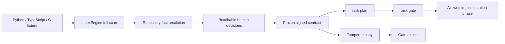

# Decision Grill Test Protocol

This document defines the reproducible closure test for the evidence-backed
Decision Grill in `task`. The acceptance boundary covers the engine, persisted
state, real code indexing, CLI, MCP JSON-RPC, plan attachment, and the
implementation gate. A passing unit test alone is not sufficient.

The latest dated local evidence is recorded in the
[2026-07-29 closure report](GRILL_TEST_REPORT_2026-07-29.md).

## Closed Loop



The fixture under `tests/fixtures/grill_robotics/` intentionally contains:

| File | Test capability |
|---|---|
| `controller.py` | Python capability registry and route compiler |
| `adapter.ts` | TypeScript robot-adapter interface and implementation |
| `safety.c` | C emergency stop and motion-safety functions |
| `decisions.json` | Repository facts plus Traditional Chinese, English, and German decisions |

The fixture is product-shaped test data, not a mock search response. Integration
tests build a fresh index from those files and use the production search
resolver.

## Acceptance Matrix

| Boundary | Required proof | Tests |
|---|---|---|
| Decision graph | prerequisite frontier, missing dependency, cycle rejection, batch bound | `test_grill.py` |
| Fact precision | exact identifier match by default; unrelated fuzzy hits remain blocked; explicit `all_terms` or `evidence_present` opt-in | `test_grill.py` |
| Human answers | only reachable human nodes, recommendations, option validation, contradictions, idempotent request IDs | `test_grill.py` |
| Persistence | atomic replace, reload, corrupt-state rejection, path traversal rejection, private permissions | `test_grill.py`, `test_grill_deep.py` |
| Concurrency | no lost updates across threads or separate POSIX processes | `test_grill_deep.py` |
| Contract integrity | incomplete freeze rejection, immutable frozen state, SHA-256 tamper rejection | `test_grill.py`, `test_grill_deep.py` |
| Input safety | bounded arrays/text, arbitrary Unicode, hostile shell/template text treated as inert data | `test_grill_deep.py` |
| Real index | Python, TypeScript, and C symbols resolve through `IndexEngine` and production search | `test_grill_real_data.py` |
| CLI | real scan → start → blocked freeze → answers → freeze → plan → gate → tamper rejection | `test_grill_cli_e2e.py` |
| MCP | real stdio JSON-RPC start → fact resolution → answer → freeze → immutable state | `test_mcp_integration.py` |
| Compatibility | unchanged public tool count and existing `task` plan/gate/validate behavior | `test_tool_registry.py`, `test_smart.py` |

## Evidence Selection Rules

Repository facts fail closed. Their default `resolution_policy` is
`exact_match`, which requires a normalized exact query match in a result name,
symbol ID, path, or summary. This prevents a high-scoring fuzzy result for an
unrelated symbol from silently satisfying a critical fact.

Use `all_terms` when an evidence query is a controlled phrase and every term
must be present. Use `evidence_present` only when the caller supplies a trusted
resolver whose own acceptance threshold is authoritative. At most five compact
evidence records are persisted per query; source bodies and unbounded provider
fields are excluded.

## Reproduce

Run the focused closure suite:

```bash
python -m pytest -q \
  tests/test_grill.py \
  tests/test_grill_deep.py \
  tests/test_grill_real_data.py \
  tests/test_grill_cli_e2e.py \
  tests/test_mcp_integration.py
```

Run the complete repository release evidence:

```bash
ruff check src tests scripts
mypy src
python -m pytest tests -v
python scripts/generate-reference.py --check
python scripts/sync-version.py --check
python -m build
python -m src.cli verify . --full-scan --strict --json
```

`task(action="validate")` uses a 900-second pytest timeout because the complete
suite includes slow, stress, race, and subprocess coverage. Set
`FLYTO_INDEXER_PYTEST_TIMEOUT` to a value from 30 through 3600 seconds when a
repository needs a different bounded CI budget.

The generated session directory can be isolated for inspection:

```bash
export FLYTO_INDEXER_GRILL_DIR=/tmp/flyto-indexer-grill
export FLYTO_INDEX_DIR=/path/to/project/.flyto-index
python -m src.cli task grill \
  --grill-action start \
  --description "Compose a safe robot route" \
  --project robot-project \
  --decisions tests/fixtures/grill_robotics/decisions.json
```

Each session is a readable JSON document with canonical IDs, answers, compact
evidence, history, readiness, and the frozen contract. Treat it as local
workflow state: it can contain user decisions and repository paths, so do not
commit it or place it in a public shared directory.

## Failure Expectations

- Missing or weak repository evidence leaves the fact open and exposes a
  repository remediation action; it never becomes a human question.
- An incomplete `freeze` returns `pass: false`; the CLI exits with status 2.
- A changed answer, evidence item, readiness field, project, or decision list
  invalidates the contract fingerprint.
- A frozen session cannot be answered or discarded.
- Resolver failures are bounded in the response and cannot be mistaken for
  evidence.
- Unsupported schemas, invalid IDs, dependency cycles, duplicate option IDs,
  oversized values, and traversal-shaped session IDs are rejected.
